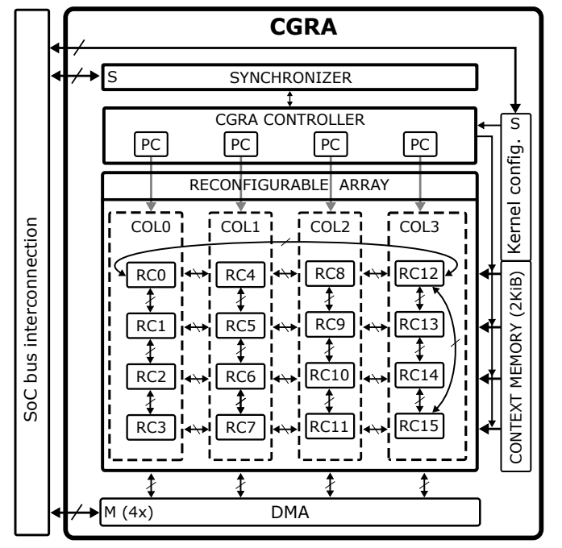

# OpenEdgeCGRA

An Open-Hardware CGRA for accelerated computation on the Edge.

Regarding the CGRA architecture, it is organized by N columns with M processing elements, named RCs, in each column. These N and M parameters can be tuned to suit your application needs. Also, the topology of the connections on the CGRA can be tuned.

In each column, the RCs share two registers: one for input and one for output. Additionally, each column has its own PC, and each column is connected to the DMA, so each column can load data in parallel. There are two ways of loading data: direct and indirect memory access.

- Direct memory access: It loads the data at the address pointed to by the input register of the column, and automatically this register updates its address to point to the next element.
- Indirect memory access: It loads the data at the address pointed to by a local register on the RC or by an output register of one of its neighbors. This way, the RC loading the data is responsible for updating the address if needed.

Each RC has 4 private registers of word size (32 bits) and an output register that is accessed by its neighbors. Every instruction executed on an RC saves the result to Rout and to the private destination register if specified.