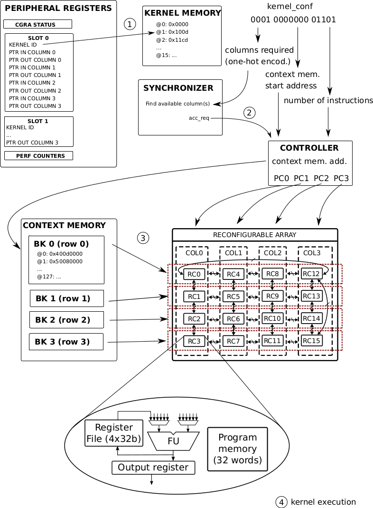

# OpenEdgeCGRA

An Open-Hardware Coarse Grained Reconfigurable Array (CGRA) for accelerated computation on the Edge.

# Instruction-based CGRA

The CGRA is a configurable $N\times M$ 2D-array of processing elements (PE, also referred to as Reconfigurable Cells, or RCs). Each PE is connected to its neighbours in a torus configuration (top PEs are connected to the bottom ones, and leftmost to rightmost).

Each PE can perform a number of operations (see the [Instruction Set)](#instruction-set)). They can load data from memory, from their own internal registers or from their neighbours' output registers. This way the CGRA can execute complex functions parallelizing operations and reducing memory accesses.

# Architecture

The OpenEdgeCGRA is organized in columns. Each column is independent from its neigbours under various persepectives:
* Different columns can run different compute intensive loops (CIL)
* Each column has its own program counter (although all columns belonging to a same CIL will share program counter count).
* Each column shares an input and output register that can be loaded with pointers during the configuration stage to allow them to seamlessly access memory. These can even point to different memory banks as to dillute the access overhead.

All CGRA operations use 32-bits words.

# Workflow

The CGRA workflow begins with an CIL, a program that we want to accelerate using the CGRA. Using the [Instruction Set](#instruction-set) that CIL is _mapped_ into the PEs. Each set of $N\times M$ PE-operations that are executed simultaneously form a CGRA-instruction. These can be as fast as a single clock cycle, but its length may be extended if long PE-operations happen during it. As a rule of thumb:
* Most operations take 1 cycle
* A multiplication takes 3 cycles
* A memory access to a memory bank has a 2-cycle overhead, plus 1 additional cycle per PE trying to access it.
* Load and store memory accesses are considered independent memory accesses, so their latencies are summed.

During each instruction, the PEs will store the result of their operation in their output register so it can be accessesed by their neighbours in the following instructions.

Branches are available. If a PE requests a branch to another instruction, all the columns executing that CIL will switch to the requested instruction in the following.

Once you have your assembly, you can test it with the [ESL-CGRA simulator](https://github.com/esl-epfl/ESL-CGRA-simulator). Note that it is a behavioural simulator, so it will not account for the aforementioned timing requirements of operations.

The assembly is then converted into two bitstreams:
* The _kernel memory_: containing the CIL configuration
* The _Instruction memory_: Contianing the instructions to be executed by each PE in each instruction.

Both bitstreams are loaded into the CGRA during the configuration. After the configuration has been loaded, the same CIL can be executed more than once without the need of re-loading the memories.

Wether the instruction memory of the PEs should be reloaded is determined by the kernel ID that is requested. That is, if you provide a different kernel ID (index inside the kernel memory), the CGRA will reload the PE's instruction memory with the configuration obtained from wherever the kernel configuration (the value stored in that index) indicates.

# Access to data
There are a number of ways to input data into a CIL execution:

- _Direct memory access:_ PEs the data at the address pointed to by the input register of the column, this register automatically updates its address to point to the next element.
- _Indirect memory access:_ It loads the data at the address pointed to by a local register on the RC or by an output register of one of its neighbors. This way, the RC loading the data is responsible for updating the address if needed.
- _Immediate in the bitstream:_ For parameters that are fixed in the CIL, it is possible to hardcode values as immediates in the assembly operation.
- _Registers:_ Each PE can access data stored in any of its four inner registers ($R_{0-3}$) or the output register ($R_{out}$) of any of its four neighbours or itself.

# Additional features of the OpenEdgeCCGRA

Our CGRA can be reconfigured to modify its dimensions. Additionally, thanks to the column-level independence, different compute intensive loops can be run in different columns of the CGRA.

This CGRA is part of a larger project called [HEEPsilon](https://github.com/esl-epfl/cgra_x_heep), where its integrated along with [X-HEEP](https://github.com/esl-epfl/x-heep) to provide a full framework from C-code to hardware.

# Instruction Set

The whole instruction set of the CGRA is available in [the ISA](docs/OpenEdgeCGRA-ISA.pdf).
